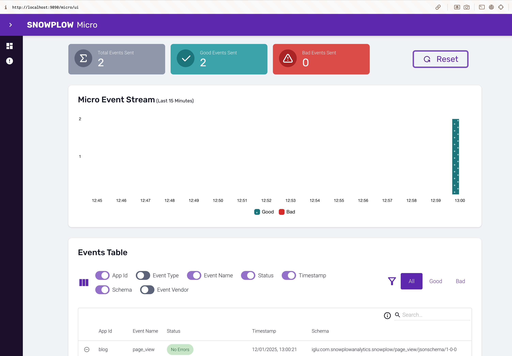
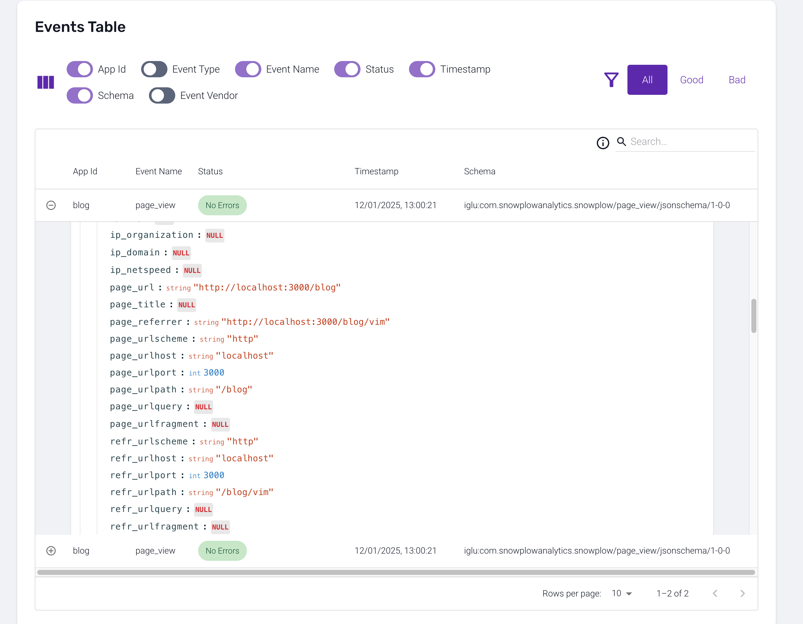
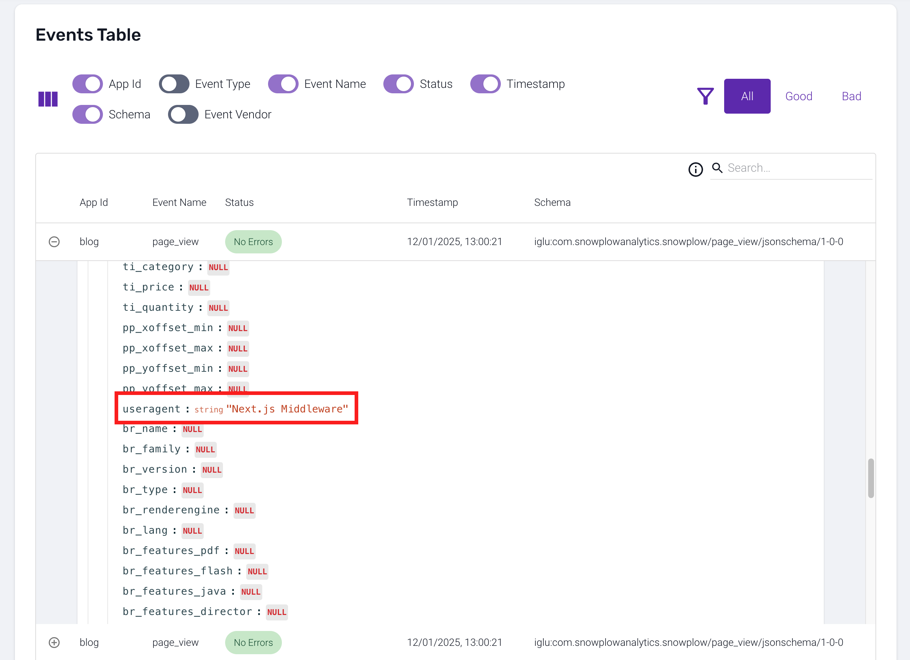

# A starter Next.JS app from portfolio-starter-kit to demo tracking with Snowplow

## ✅ Preprequisites

-   Node.js
-   pnpm

## ✅ Setup template

### 1. Clone and enter the project

```bash
git clone -b 1-setup-template git@github.com:evelynforkhands/next-snowplow-tracking-demo.git
```

### 2. Install dependencies

```bash
pnpm install
```

### 3. Run the development server

```bash
pnpm dev
```

Now you have a blog with some example posts! You can view the blog at `http://localhost:3000`.

## ✅ Setup Snowplow node tracker & prepare types

### 1. Install Snowplow tracker

```bash
pnpm add @snowplow/node-tracker
```

### 2. Initialize Snowplow tracker

Let's create a new file `lib/snowplow.ts` where we will initialize the Snowplow tracker.

```ts
import { newTracker } from "@snowplow/node-tracker";

const tracker = newTracker(
    {
        namespace: "blog-tracker",
        appId: "blog",
        encodeBase64: false,
    },
    {
        endpoint: "http://localhost",
        port: 9090, // for local dev - to talk to Snowplow Micro
        eventMethod: "post",
        bufferSize: 1, // only send events once n are buffered
    }
);

export default tracker;
```

### 3. Prepare types

First, we're going to track some pageViews, let's set up a type for that at `lib/snowplow/types/pageView.ts` to follow [the format of the Snowplow pageView event.](https://docs.snowplow.io/docs/sources/trackers/javascript-trackers/node-js-tracker/node-js-tracker-v4/tracking-events/#track-pageviews-withbuildpageview)

```ts
interface PageView {
    pageUrl: string;
    pageTitle?: string;
    referrer?: string;
}

export default PageView;
```

Now let's create a method to track pageViews in `lib/snowplow/trackPageView.ts`

```ts
import tracker from "./tracker";
import { buildPageView } from "@snowplow/node-tracker";
import PageView from "./types/pageView";

export default function trackPageView(pageView: PageView) {
    tracker.track(buildPageView(pageView));
}
```

## ✅ Track pageViews server-side using middleware

To implement server-side tracking, we will use a custom middleware that will track pageViews on every request. Analytics is a common [use case for middleware.](https://nextjs.org/docs/app/building-your-application/routing/middleware)

### 1. Create middleware to track pageViews

Let's create a new file `middleware.ts` in the root of our project where we will track pageViews on every request.
For now, let's just track pageViews for blog articles by matching the path `/blog/:path*`. Read more about matchers [here](https://nextjs.org/docs/app/building-your-application/routing/middleware#matcher).

```ts
import trackPageView from "lib/snowplow/trackPageView";
import { NextResponse } from "next/server";
import { NextRequest } from "next/server";

export function middleware(request: NextRequest) {
    trackPageView({
        pageUrl: request.url,
        referrer: request.headers.get("referer") || undefined,
    });
    return NextResponse.next();
}

export const config = {
    matcher: "/blog/:path*",
};
```

Now every page view for blog articles will be tracked server-side.



We can browse all event data in the Snowplow Micro UI at `http://localhost:9090/micro/ui`.



## 🟡 Set useragent from client

(you are here!)
Notice that the user agent is set to "Next.js Middleware" in the event data.



Let's set the user agent to the actual user agent of the client in the middleware.

### 2. Set the user agent in the middleware

Let's set up a new method in `lib/snowplow/setUserProperties.ts` to set user properties, we can in the future set more user properties when needed.

```ts
import tracker from "../tracker";

interface UserProperties {
    userAgent?: string;
}

export function setUserProperties(userProperties: UserProperties) {
    tracker.setUseragent(userProperties.userAgent ?? "");
}
```

Notice that we are setting the user agent to an empty string if it's not provided - this is to avoid sending `Next.js Middleware`, or any other useragents that might confuse you later on as the user agent. Plus arguably, that would be a waste of storage unless we have a use case for it.
